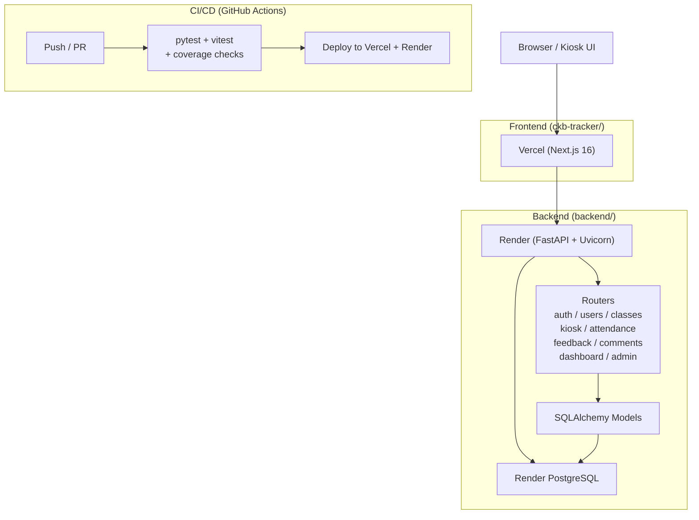

# CKB Tracker

Martial arts school attendance tracking, student progress monitoring, and gym management system.

**Live:** Frontend → [ckb-tracker.vercel.app](https://ckb-tracker.vercel.app) | Backend → [ckb-tracker-api-dev.onrender.com](https://ckb-tracker-api-dev.onrender.com)

---

## Tech Stack

| Layer | Technology |
|-------|------------|
| Frontend | Next.js 16 (App Router), TypeScript, Tailwind CSS v4 |
| Backend | Python 3.12+, FastAPI, SQLAlchemy, Pydantic v2 |
| Database | SQLite (dev) / PostgreSQL (production, Render managed) |
| Auth | JWT (access + refresh tokens), CSRF double-submit cookie, bcrypt |
| Testing | pytest + pytest-cov (backend), Vitest (frontend unit), Playwright (E2E) |
| CI/CD | GitHub Actions → test → deploy to Vercel + Render |
| Infrastructure | Vercel (frontend), Render (backend + PostgreSQL) |

---

## Architecture



---

## Data Model

### Entity Relationship Diagram

```mermaid
erDiagram
    USERS ||--o{ USER_ROLES : has
    ROLES ||--o{ USER_ROLES : assigns
    USERS ||--o{ ATTENDANCE : attends
    USERS ||--o{ CLASS_FEEDBACK : gives
    USERS ||--o{ COMMENTS : authors
    USERS ||--o{ COMMENTS : "targeted by"
    USERS ||--o{ SESSION_TOKENS : "owns tokens"
    GYM_LOCATIONS ||--o{ CLASS_SCHEDULE : hosts
    CLASS_TYPES ||--o{ CLASS_SCHEDULE : categorizes
    CLASS_SCHEDULE ||--o{ ATTENDANCE : tracks
    CLASS_SCHEDULE ||--o{ CLASS_INSTANCES : "has instances"
    CLASS_SCHEDULE ||--o| CURRICULUM : "has curriculum"
    CURRICULUM ||--o{ LESSONS : contains
    CLASS_INSTANCES ||--o{ ATTENDANCE : records
    CLASS_INSTANCES ||--o{ CLASS_FEEDBACK : receives
    TERMS ||--o{ TERM_TARGETS : defines
    ATTENDANCE ||--o| CLASS_FEEDBACK : "optional feedback"
    COMMENTS ||--o{ COMMENTS : "self-referential (replies)"

    USERS {
        int id PK
        string user_uuid UK
        string first_name
        string last_name
        string email UK
        string password_hash "bcrypt"
        string pin_hash "bcrypt, nullable"
        string rank "default: White"
        date last_graded_date
        text comments
        string nicknames
        string profile_image_url
        float image_offset_x
        float image_offset_y
        bool is_current
        datetime effective_date
        datetime end_date
        datetime created_date
        datetime updated_date
    }

    ROLES {
        int id PK
        string name UK "Student|Teacher|Admin|Tablet|Kiosk"
        text description
    }

    USER_ROLES {
        int id PK
        string user_uuid FK
        int role_id FK
        bool is_current
        datetime effective_date
        datetime end_date
        datetime created_date
        datetime updated_date
    }

    GYM_LOCATIONS {
        int id PK
        string name UK
        text address
    }

    CLASS_TYPES {
        int id PK
        string name UK "Gi|No-Gi|MMA|Open Mat|Kids"
    }

    CLASS_SCHEDULE {
        int id PK
        string class_uuid UK
        string class_name
        string day "Monday-Sunday"
        string time "HH:MM"
        text description
        float points
        int gym_id FK
        int class_type_id FK
        bool is_current
        datetime effective_date
        datetime end_date
        datetime created_date
    }

    CLASS_INSTANCES {
        int id PK
        int class_id FK
        date class_date
        string teacher_uuid FK
        int lesson_id FK
        datetime created_at
        datetime updated_at
    }

    ATTENDANCE {
        int id PK
        string user_uuid FK
        int class_id FK
        int class_instance_id FK
        string teacher_uuid FK
        int user_role_id FK
        date attendance_date
        string status "pending|confirmed|cancelled"
        string confirmed_by FK
        datetime confirmed_at
        datetime created_at
    }

    CLASS_FEEDBACK {
        int id PK
        string user_uuid FK
        int attendance_id FK
        int class_instance_id FK
        string rating "thumbs_up|thumbs_down"
        text comment
        datetime created_at
        datetime updated_at
    }

    COMMENTS {
        int id PK
        string comment_uuid UK
        int parent_comment_id FK "self-ref"
        string author_uuid FK
        string target_user_uuid FK
        text content
        string rating "positive|negative"
        datetime created_at
        datetime updated_at
    }

    TERMS {
        int id PK
        string term_name UK
        date start_date
        date end_date
        datetime created_at
    }

    TERM_TARGETS {
        int id PK
        int term_id FK
        string rank
        float target "attendance points goal"
    }

    CURRICULUM {
        int id PK
        int class_id FK UK
        string name
        text description
        datetime created_at
        datetime updated_at
    }

    LESSONS {
        int id PK
        int curriculum_id FK
        string title
        text description
        string lesson_plan_url
        string video_folder_url
        datetime created_at
        datetime updated_at
    }

    SESSION_TOKENS {
        int id PK
        string token_jti UK
        string user_uuid FK
        string token_type "access|refresh"
        datetime expires_at
        datetime created_at
    }

    AUDIT_LOGS {
        int id PK
        datetime timestamp
        string actor_uuid
        string action
        string resource_type
        string resource_uuid
        text detail
        string ip_address
        string user_agent
        bool success
    }

    WEBSITE_THEMES {
        int id PK
        string name UK
        bool is_active
        text config JSON
        datetime created_at
        datetime updated_at
    }

    NEWS {
        int id PK
        string title
        text content
        bool is_published
        datetime created_at
        datetime updated_at
    }

    KIOSK_AUTH {
        int id PK
        string pin_hash "legacy kiosk PIN"
        datetime created_at
        datetime updated_at
    }
```

### Table Relationships Summary

```
users ──┬── user_roles ── roles          (many-to-many via user_roles)
        ├── attendance                    (student check-ins)
        ├── class_feedback               (student feedback on classes)
        ├── comments (as author)         (coach feedback on students)
        ├── comments (as target_user)    (student receiving feedback)
        ├── class_instances (as teacher) (which teacher taught)
        └── session_tokens              (JWT tracking/revocation)

class_schedule ──┬── gym_locations       (which gym)
                 ├── class_types         (Gi, No-Gi, etc.)
                 ├── attendance          (per-session records)
                 ├── class_instances     (occurrences on specific dates)
                 └── curriculum ── lessons (lesson plans)

terms ── term_targets                    (points needed per rank per term)
```

---

## API Endpoints

### Auth (`/auth`)

| Method | Path | Auth | Rate Limit | Description |
|--------|------|------|------------|-------------|
| POST | `/auth/login` | — | 5/min | Email/password login, returns JWT cookies |
| POST | `/auth/teacher-login` | — | 5/min | Teacher/admin-only login |
| POST | `/auth/refresh` | Cookie | 10/min | Rotate refresh token, get new access token |
| POST | `/auth/logout` | Cookie | 60/min | Revoke current tokens, clear cookies |
| POST | `/auth/logout-all` | Cookie | 60/min | Revoke all user sessions |
| GET | `/auth/me` | JWT | 60/min | Current user info + roles |
| GET | `/auth/csrf-token` | — | 60/min | Get CSRF token |
| GET | `/auth/check-password/{uuid}` | JWT | 60/min | Check if user has password set |

### Kiosk (`/kiosk`)

| Method | Path | Auth | Rate Limit | Description |
|--------|------|------|------------|-------------|
| POST | `/kiosk/unlock` | — | 5/min | Staff email/password → unlocks kiosk |
| POST | `/kiosk/lock` | JWT | 5/min | Revoke kiosk session, lock kiosk |
| POST | `/kiosk/verify-user-pin` | JWT | 10/min | Find user by PIN (all users) |
| POST | `/kiosk/verify-pin-for-user` | JWT | 10/min | Verify specific user's PIN |
| POST | `/kiosk/verify-pin` | JWT | 10/min | Legacy kiosk PIN verification |
| PUT | `/kiosk/update-pin` | JWT | 10/min | Update kiosk PIN |
| POST | `/kiosk/setup` | JWT | 3/min | Initialize/change kiosk PIN |

### Users (`/users`)

| Method | Path | Auth | Description |
|--------|------|------|-------------|
| GET | `/users` | Admin | List all users (paginated, filterable) |
| GET | `/users/{uuid}` | JWT | Get user details |
| POST | `/users` | Admin | Create user |
| PUT | `/users/{uuid}` | Admin | Update user |
| DELETE | `/users/{uuid}` | Admin | Soft-delete user |
| POST | `/users/{uuid}/photo` | JWT | Upload profile photo |

### Classes (`/classes`)

| Method | Path | Auth | Description |
|--------|------|------|-------------|
| GET | `/classes` | — | List active class schedules |
| POST | `/classes` | Admin | Create class schedule |
| PUT | `/classes/{id}` | Admin | Update class |
| DELETE | `/classes/{id}` | Admin | Soft-delete class |

### Attendance (`/attendance`)

| Method | Path | Auth | Description |
|--------|------|------|-------------|
| GET | `/attendance/user/{uuid}` | JWT | User's attendance records |
| GET | `/attendance/date` | JWT | Attendance by date |
| POST | `/attendance/check-in` | JWT | Single class check-in |
| POST | `/attendance/bulk-check-in` | JWT | Bulk check-in (multiple classes) |
| POST | `/attendance/confirm` | Teacher | Confirm pending attendance |
| POST | `/attendance/cancel` | Teacher | Cancel attendance |
| GET | `/attendance/pending` | Teacher | List pending attendance |
| GET | `/attendance/stats/{uuid}` | JWT | User attendance statistics |

### Dashboard (`/dashboard`)

| Method | Path | Auth | Description |
|--------|------|------|-------------|
| GET | `/dashboard/{uuid}` | JWT | Class count, points, trend data |
| GET | `/dashboard/{uuid}/attendance-trend` | JWT | Monthly attendance breakdown |

### Comments (`/comments`)

| Method | Path | Auth | Description |
|--------|------|------|-------------|
| GET | `/comments/user/{uuid}` | JWT | Comments about a user |
| POST | `/comments` | Teacher | Create comment |
| PUT | `/comments/{id}` | Teacher | Update comment |
| DELETE | `/comments/{id}` | Teacher | Delete comment |

### Other Endpoints

| Path | Auth | Description |
|------|------|-------------|
| `/gym-locations` | Admin | CRUD gym locations |
| `/class-types` | Admin | CRUD class types |
| `/class-instances` | JWT | CRUD class instances (specific dates) |
| `/curricula` | Admin | CRUD curricula linked to classes |
| `/lessons` | Admin | CRUD lessons within curricula |
| `/terms` | Admin | CRUD academic terms |
| `/feedback` | JWT | CRUD class feedback |
| `/roles` | Admin | List roles |
| `/news` | — | Published news (GET) / Admin CRUD |
| `/themes` | Admin | Website theme management |
| `/database` | Admin | DB stats endpoint |
| `/audit` | Admin | Paginated audit log viewer |

---

## Frontend Routes

| Route | Access | Description |
|-------|--------|-------------|
| `/` | Public | Kiosk landing page (locked/unlocked) |
| `/login` | Public | Staff login (admin/teacher dashboard) |
| `/kiosk/select` | Kiosk | Student class selection |
| `/kiosk/confirm` | Kiosk | PIN re-entry + confirmation |
| `/check-in` | JWT | Tablet check-in flow |
| `/portal` | JWT | Student portal (attendance, progress) |
| `/teacher` | Teacher | Teacher dashboard |
| `/admin` | Admin | Admin dashboard (users, classes, data) |
| `/(protected)` | JWT | Various protected routes |

### Kiosk Security Model

The kiosk at `/` has two states:

- **LOCKED** (default): Branding + "Staff Sign In" button + news feed. No API calls to protected endpoints.
- **UNLOCKED**: Staff authenticated via `/kiosk/unlock`. Students can search → enter PIN → select classes → check in.

Key rules:
- Staff JWT stored in JavaScript memory (module variable), never localStorage/cookies
- 60-second idle timer → auto-lock + discard token
- PIN endpoints protected by `Authorization: Bearer <staff_token>`
- PIN lockout: 3 failed attempts → 5-minute cooldown (429 + Retry-After)

---

## Getting Started

### Prerequisites

- Node.js 20+ (frontend)
- Python 3.12+ with [uv](https://docs.astral.sh/uv/) (backend)

### Backend Setup

```bash
cd backend
uv sync
uv run uvicorn app.main:app --reload
# → http://localhost:8000
```

The server auto-seeds demo data on first startup (14 users, 8 classes, 60 days of attendance history, curricula, lessons, feedback, comments, and news).

### Frontend Setup

```bash
cd ckb-tracker
npm install
npm run dev
# → http://localhost:3000
```

Set `NEXT_PUBLIC_API_URL=http://localhost:8000` in `.env.local` (defaults to Render production URL otherwise).

### Running Tests

```bash
# Backend (pytest + coverage)
cd backend
uv run pytest tests/ --cov=app --cov-report=term-missing

# Frontend unit (Vitest)
cd ckb-tracker
npm run test

# Frontend E2E (Playwright — requires backend + frontend running)
cd ckb-tracker
npx playwright test
```

---

## Project Structure

```
├── backend/
│   ├── app/
│   │   ├── main.py              # FastAPI app, middleware, lifespan
│   │   ├── database.py          # SQLAlchemy engine + session
│   │   ├── models.py            # 18 ORM models
│   │   ├── schemas.py           # Pydantic v2 request/response schemas
│   │   ├── auth/
│   │   │   ├── config.py        # Token durations, cookie settings
│   │   │   ├── csrf.py          # CSRF token generation + validation
│   │   │   ├── jwt_utils.py     # JWT create/decode/revoke
│   │   │   └── limiter.py       # Rate limit tiers (slowapi)
│   │   ├── routers/             # 20 route modules
│   │   ├── services/
│   │   │   └── audit.py         # Structured audit logging
│   │   └── __init__.py
│   ├── tests/                   # pytest suite (128+ tests, 85% cov)
│   ├── scripts/
│   │   └── generate_secrets.py  # Secure key generation
│   ├── seed_complete_data.py    # Full demo data seeder
│   ├── render.yaml              # Render Blueprint (web + DB)
│   └── pyproject.toml
│
├── ckb-tracker/
│   ├── src/
│   │   ├── app/
│   │   │   ├── page.tsx         # Kiosk landing (locked/unlocked)
│   │   │   ├── layout.tsx       # Root layout + providers
│   │   │   ├── kiosk/           # Kiosk context + UI components
│   │   │   ├── login/           # Staff login page
│   │   │   ├── check-in/        # Tablet check-in page
│   │   │   ├── portal/          # Student portal
│   │   │   ├── teacher/         # Teacher dashboard
│   │   │   └── admin/           # Admin dashboard
│   │   ├── components/          # Shared UI components
│   │   ├── lib/
│   │   │   ├── api.ts           # Axios client + all API methods
│   │   │   ├── supabase.ts      # Supabase client config
│   │   │   └── utils.ts         # Utility functions
│   │   ├── types/
│   │   │   └── index.ts         # Shared TypeScript types
│   │   └── __tests__/           # Vitest test files
│   ├── e2e/                     # Playwright E2E tests
│   ├── vercel.json
│   └── package.json
│
├── .github/workflows/
│   ├── test.yml                 # CI (every push/PR)
│   └── deploy.yml               # CD (push to main)
│
├── deployment_phases.md         # Deployment planning
├── progress.md                  # Full project changelog
├── deploy_steps.md              # Deployment guide
└── AGENTS.md                    # AI agent guidelines
```

---

### Check-In Flow by User Type

| Who | PIN Required? | Notes |
|-----|---------------|-------|
| Student (kiosk) | ✅ Yes | Self-service kiosk flow |
| Tablet user | ✅ Yes | Operator checks in students |
| Teacher | ❌ No | Direct bypass |
| Admin | ❌ No | Direct bypass |

---

## Security Features

- **JWT with rotation**: Short-lived access tokens (10 min), refresh token rotation with revocation
- **CSRF protection**: Double-submit cookie pattern, constant-time comparison, Bearer token exemption
- **Rate limiting**: 12 tiers across all endpoints (auth: 5/min, PIN: 10/min, general: 60/min)
- **PIN lockout**: 3 failed attempts → 5-minute cooldown with `Retry-After` header
- **Password policy**: 8+ chars, uppercase, lowercase, digit, special character required
- **Audit logging**: 15+ event types tracked with actor, IP, user-agent, success/failure
- **Security headers**: HSTS, CSP, X-Content-Type-Options, X-Frame-Options, Referrer-Policy, Permissions-Policy
- **Request size limits**: 1 MB JSON, 10 MB multipart
- **Global exception handler**: No stack trace leakage in production
- **Server-side session management**: JTI blacklisting, 24-hour absolute session cap
- **Kiosk token**: In-memory only (no localStorage), auto-cleared on 60s idle

---

## Deployment

Deployment is automated via GitHub Actions:

1. Push/PR to any branch → runs `test.yml` (pytest + vitest + coverage)
2. Push to `main` → runs `deploy.yml` (tests → Render deploy hook → Vercel deploy)

| Environment | Frontend | Backend | Database |
|-------------|----------|---------|----------|
| Development | `localhost:3000` | `localhost:8000` | SQLite |
| Staging/Prod | `ckb-tracker.vercel.app` | `ckb-tracker-api-dev.onrender.com` | Render PostgreSQL |

---

## Live Testing — Seed Data

During the live testing phase, the database on Render can be populated with demo data for testing.

### Auto-Seed on First Deploy

When the app starts on an empty database (first deploy), it automatically seeds:

- **14 users** (admin, teachers, students, kiosk, tablet)
- **8 class schedules** across 2 gym locations
- **Academic terms** with targets
- **60 days of attendance history**
- **Curricula and lessons**
- **Feedback, comments, and news items**

Data persists across subsequent deploys — only the first deploy (empty DB) triggers a seed.

### Admin Seed Endpoint

Trigger a full reseed on demand:

```bash
curl -X POST https://ckb-tracker-api-dev.onrender.com/admin/seed \
  -H "Authorization: Bearer <admin_token>"
```

Rate-limited to 1 request per minute. Requires admin authentication.

### CSV User Import

Import custom users by CSV via the existing endpoint:

```bash
curl -X POST https://ckb-tracker-api-dev.onrender.com/users/import-csv \
  -H "Authorization: Bearer <admin_token>" \
  -F "file=@users.csv"
```

CSV columns: `first_name, last_name, email, rank, nicknames, comments`
Max 500 rows per import.

### Reset the Database

To wipe all data and start fresh:

1. Set `DROP_ALL_ON_STARTUP=1` in Render Dashboard env vars
2. Restart the Render web service
3. Remove the env var to prevent future wipes
4. On next deploy (or restart), the seed data is regenerated

### Demo Credentials

| Role | Email | Password | PIN |
|------|-------|----------|-----|
| Kiosk unlock | kiosk@ckbtracker.com | kiosk123 | — |
| Admin | admin@example.com | admin123 | — |
| Teacher | mike@example.com | password123 | — |
| Teacher | sarah@example.com | password123 | — |
| Tablet | tablet@example.com | tablet123 | 1006 |
| Student | john@example.com | password123 | 1001 |
| Student | jane@example.com | password123 | 1002 |
| No PIN | nopin@example.com | password123 | (none) |
| Inactive | inactive@example.com | (disabled) | — |

---

## License

Internal project — City Kickboxing BJJitsu.
